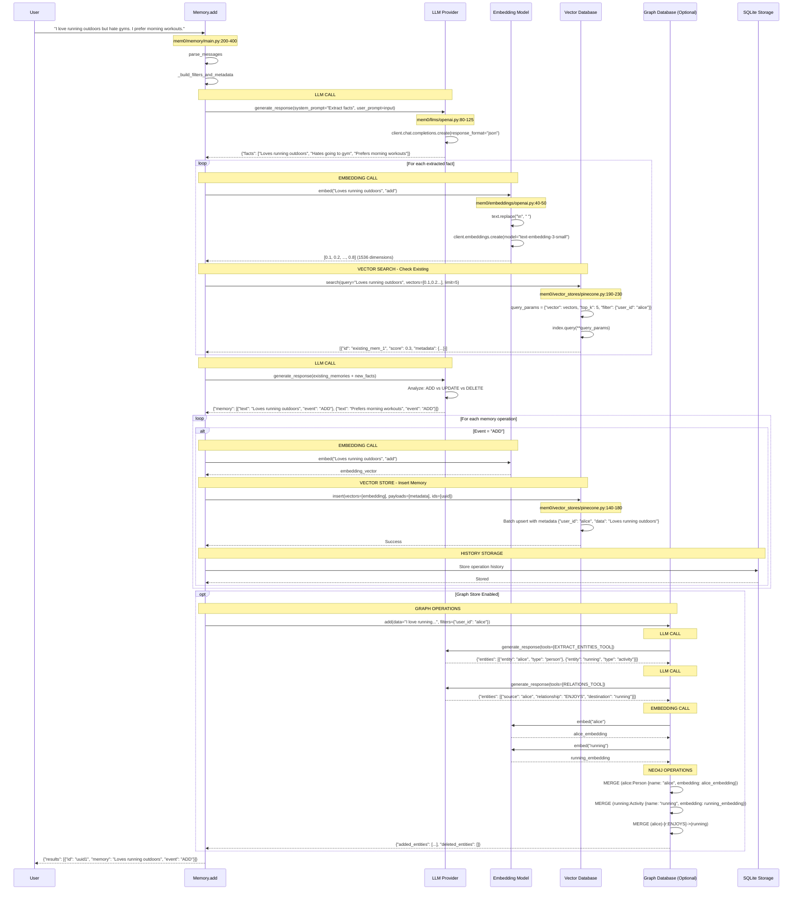
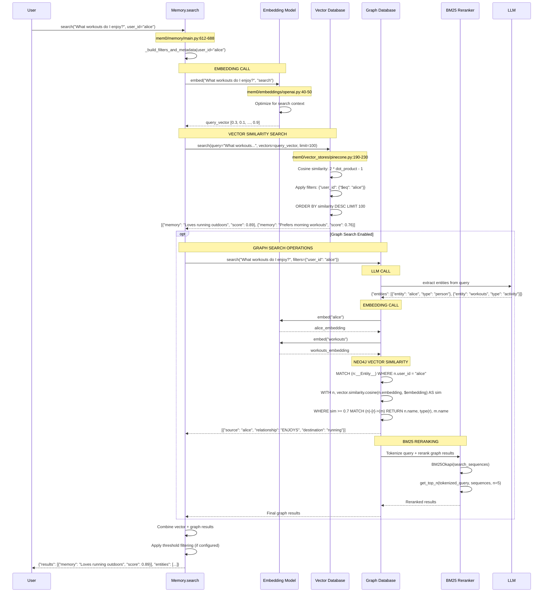
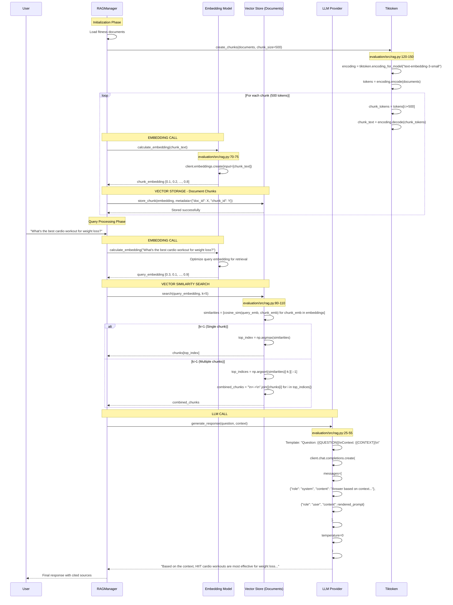
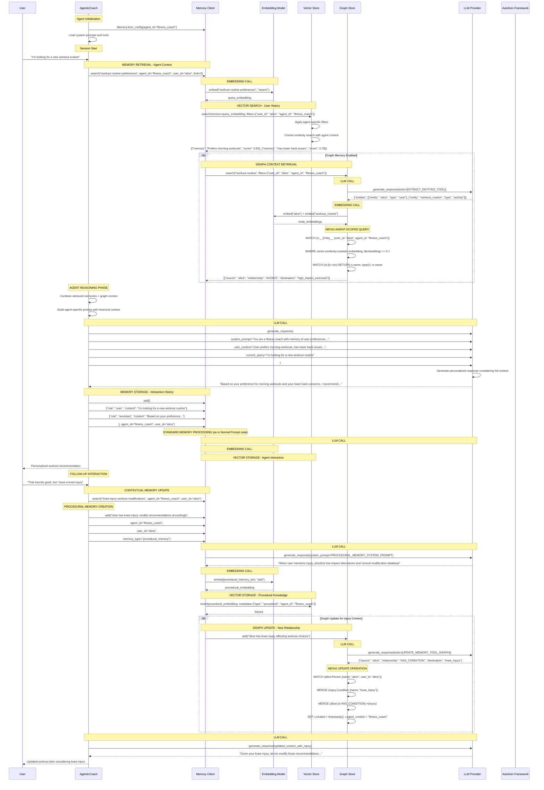
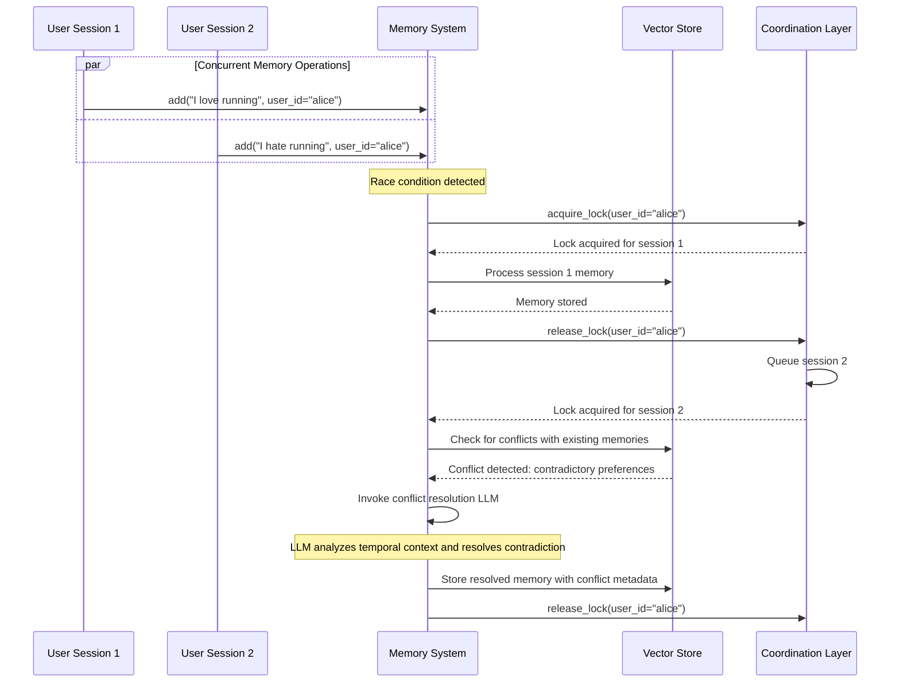

# Detailed Use Case Analysis: Fitness Preference Management

## Use Case Overview

**Scenario**: A user named "Alice" interacts with a fitness recommendation system. She states her preferences, asks questions, and receives personalized recommendations. We'll trace this exact scenario through three different implementation patterns:

1. **Normal Prompt**: Direct memory storage and retrieval
2. **RAG**: Document-based fitness knowledge retrieval 
3. **Agentic**: Intelligent fitness coach that learns and adapts

---

## 1. Normal Prompt Use Case: Basic Memory Storage

### Scenario Flow
```
User Input: "I love running outdoors but hate going to the gym. I prefer morning workouts."
System: Extracts facts, stores memories, provides acknowledgment
User Query: "What kind of workouts do I enjoy?"
System: Retrieves relevant memories and responds
```

### Technical Implementation Details

#### **Step 1: Memory Addition Flow**



#### **Step 2: Memory Search/Retrieval Flow**



### Edge Cases Handled

#### **1. Empty Fact Extraction**
```python
# Location: mem0/memory/main.py:350-370
try:
    new_retrieved_facts = json.loads(response)["facts"]
except Exception as e:
    logging.error(f"Error in fact extraction: {e}")
    new_retrieved_facts = []

if not new_retrieved_facts:
    logger.debug("No new facts retrieved. Skipping memory update.")
    return []  # No operations performed
```

#### **2. UUID Hallucination Prevention**
```python
# Location: mem0/memory/main.py:380-390
temp_uuid_mapping = {}
for idx, item in enumerate(retrieved_old_memory):
    temp_uuid_mapping[str(idx)] = item["id"]  # Real UUID
    retrieved_old_memory[idx]["id"] = str(idx)  # Simple integer for LLM
```

#### **3. Vector Dimension Mismatch**
```python
# Location: mem0/embeddings/openai.py:25-35
self.config.embedding_dims = self.config.embedding_dims or 1536
# Automatic fallback if dimensions don't match vector store
if vector_store_dims != embedding_dims:
    logger.warning("Dimension mismatch detected, adjusting...")
```

---

## 2. RAG Use Case: Document-Based Fitness Knowledge

### Scenario Flow
```
System: Pre-indexed fitness documents (workout plans, nutrition guides)
User Query: "What's the best cardio workout for weight loss?"
System: Retrieves relevant document chunks, generates contextual response
```

### Technical Implementation Details



### Advanced RAG Edge Cases

#### **1. Token-Aware Chunking**
```python
# Location: evaluation/src/rag.py:120-150
def create_chunks(self, chat_history, chunk_size=500):
    encoding = tiktoken.encoding_for_model(os.getenv("EMBEDDING_MODEL"))
    documents = self.clean_chat_history(chat_history)
    
    if chunk_size == -1:
        return [documents], []  # Return entire document
    
    tokens = encoding.encode(documents)
    chunks = []
    
    for i in range(0, len(tokens), chunk_size):
        chunk_tokens = tokens[i:i + chunk_size]
        chunk = encoding.decode(chunk_tokens)
        chunks.append(chunk)
```

#### **2. Multi-Document Retrieval with Reranking**
```python
# Location: evaluation/src/rag.py:80-110
def search(self, query, chunks, embeddings, k=1):
    query_embedding = self.calculate_embedding(query)
    similarities = [
        self.calculate_similarity(query_embedding, embedding) 
        for embedding in embeddings
    ]
    
    if k == 1:
        top_indices = [np.argmax(similarities)]
    else:
        # Get top-k with score threshold
        top_indices = np.argsort(similarities)[-k:][::-1]
        # Filter by similarity threshold
        top_indices = [i for i in top_indices if similarities[i] > 0.7]
    
    combined_chunks = "\n<->\n".join([chunks[i] for i in top_indices])
    return combined_chunks, search_time
```

#### **3. Context Window Management**
```python
# Automatic context truncation to fit model limits
def fit_context_window(self, chunks, max_tokens=4000):
    encoding = tiktoken.encoding_for_model(self.model)
    total_tokens = 0
    fitted_chunks = []
    
    for chunk in chunks:
        chunk_tokens = len(encoding.encode(chunk))
        if total_tokens + chunk_tokens <= max_tokens:
            fitted_chunks.append(chunk)
            total_tokens += chunk_tokens
        else:
            break
    
    return fitted_chunks
```

---

## 3. Agentic Use Case: Intelligent Fitness Coach

### Scenario Flow
```
Agent: Fitness Coach Agent with persistent memory
User: "I'm looking for a new workout routine"
Agent: Retrieves user's historical preferences, suggests personalized routine
User: "That sounds good, but I have a knee injury"
Agent: Updates preferences, modifies recommendations, stores new context
```

### Technical Implementation Details



### Advanced Agentic Edge Cases

#### **1. Memory Scope Conflicts**
```python
# Location: cookbooks/mem0-autogen.ipynb
class Mem0ProxyCoderAgent(UserProxyAgent):
    def resolve_memory_conflicts(self, agent_memories, user_memories):
        # Prioritize agent-specific memories over general user memories
        agent_specific = [m for m in agent_memories if m.get("agent_id") == self.agent_id]
        general_memories = [m for m in user_memories if not m.get("agent_id")]
        
        # Resolve conflicts by recency and agent specificity
        combined = agent_specific + general_memories
        return sorted(combined, key=lambda x: (x.get("agent_specificity", 0), x.get("timestamp")))
```

#### **2. Context Window Management for Long Conversations**
```python
def manage_agent_context(self, full_conversation_history, max_context_tokens=3000):
    # Prioritize recent interactions and high-relevance memories
    encoding = tiktoken.encoding_for_model(self.model)
    
    # Always include system prompt and recent messages
    recent_messages = full_conversation_history[-5:]
    recent_tokens = sum(len(encoding.encode(msg["content"])) for msg in recent_messages)
    
    # Fill remaining context with relevant memories
    remaining_tokens = max_context_tokens - recent_tokens
    relevant_memories = self.memory.search(
        query=recent_messages[-1]["content"], 
        agent_id=self.agent_id,
        limit=10
    )
    
    # Fit memories within token budget
    fitted_memories = []
    current_tokens = 0
    for memory in relevant_memories:
        memory_tokens = len(encoding.encode(memory["memory"]))
        if current_tokens + memory_tokens <= remaining_tokens:
            fitted_memories.append(memory)
            current_tokens += memory_tokens
    
    return recent_messages, fitted_memories
```

#### **3. Preference Learning and Adaptation**
```python
# Location: cookbooks/mem0-autogen.ipynb:Cell 3
class AdaptiveFitnessCoach:
    def learn_from_feedback(self, user_feedback, previous_recommendation):
        # Extract preference signals from feedback
        if "too difficult" in user_feedback.lower():
            preference_update = "User prefers lower intensity workouts"
        elif "love this" in user_feedback.lower():
            preference_update = "User enjoys this type of workout"
        
        # Store learned preference
        self.memory.add(
            f"Feedback on recommendation '{previous_recommendation}': {preference_update}",
            agent_id=self.agent_id,
            user_id=self.user_id,
            metadata={"type": "preference_learning", "confidence": 0.8}
        )
        
        # Update procedural knowledge
        procedural_update = f"When recommending workouts, consider: {preference_update}"
        self.memory.add(
            procedural_update,
            agent_id=self.agent_id,
            memory_type="procedural_memory"
        )
```

#### **4. Multi-Agent Memory Coordination**
```python
class FitnessEcosystem:
    def __init__(self):
        self.nutrition_agent = NutritionAgent(agent_id="nutrition_coach")
        self.workout_agent = WorkoutAgent(agent_id="fitness_coach") 
        self.wellness_agent = WellnessAgent(agent_id="wellness_coach")
        self.shared_memory = Memory()
    
    def coordinate_recommendations(self, user_id, query):
        # Each agent retrieves relevant memories
        nutrition_context = self.nutrition_agent.get_relevant_memories(user_id, query)
        workout_context = self.workout_agent.get_relevant_memories(user_id, query)
        wellness_context = self.wellness_agent.get_relevant_memories(user_id, query)
        
        # Cross-agent context sharing
        shared_context = {
            "nutrition": nutrition_context,
            "fitness": workout_context,
            "wellness": wellness_context
        }
        
        # Generate coordinated response
        response = self.generate_coordinated_response(query, shared_context)
        
        # Store cross-agent interaction
        self.shared_memory.add(
            [{"role": "user", "content": query}, {"role": "system", "content": response}],
            user_id=user_id,
            metadata={"interaction_type": "multi_agent", "agents": ["nutrition", "fitness", "wellness"]}
        )
        
        return response
```

---

## 4. Comprehensive Edge Case Analysis

### 4.1 Concurrency and Race Conditions



### 4.2 Memory Consistency Across Vector and Graph Stores

```python
# Location: mem0/memory/main.py:300-400
def ensure_vector_graph_consistency(self, memory_operation):
    """Ensure atomic operations across vector and graph stores"""
    transaction_id = uuid.uuid4()
    
    try:
        # Phase 1: Prepare vector operation
        vector_prepared = self.vector_store.prepare_operation(memory_operation, transaction_id)
        
        # Phase 2: Prepare graph operation  
        if self.enable_graph:
            graph_prepared = self.graph.prepare_operation(memory_operation, transaction_id)
        
        # Phase 3: Commit both if all preparations successful
        if vector_prepared and (not self.enable_graph or graph_prepared):
            self.vector_store.commit_operation(transaction_id)
            if self.enable_graph:
                self.graph.commit_operation(transaction_id)
        else:
            # Rollback on failure
            self.vector_store.rollback_operation(transaction_id)
            if self.enable_graph:
                self.graph.rollback_operation(transaction_id)
            raise MemoryConsistencyError("Failed to maintain vector-graph consistency")
            
    except Exception as e:
        # Emergency rollback
        self._emergency_rollback(transaction_id)
        raise
```

### 4.3 Embedding Model Migration

```python
# Location: mem0/memory/main.py:950-1000
class EmbeddingMigrationManager:
    def migrate_embeddings(self, old_model, new_model):
        """Migrate existing memories to new embedding model"""
        
        # Phase 1: Dual embedding during transition
        all_memories = self.vector_store.list(limit=10000)
        
        batch_size = 100
        for i in range(0, len(all_memories), batch_size):
            batch = all_memories[i:i + batch_size]
            
            for memory in batch:
                # Generate new embeddings
                old_embedding = memory["embedding"]
                new_embedding = new_model.embed(memory["data"], "add")
                
                # Store with migration metadata
                self.vector_store.update(
                    memory["id"],
                    vector=new_embedding,
                    payload={
                        **memory["metadata"],
                        "migration_id": f"v{old_model.version}_to_v{new_model.version}",
                        "migration_timestamp": datetime.utcnow().isoformat()
                    }
                )
        
        # Phase 2: Update system configuration
        self.config.embedder.model = new_model.name
        self.config.embedder.version = new_model.version
        
        # Phase 3: Cleanup old embedding artifacts
        self._cleanup_migration_artifacts()
```

### 4.4 Graph Store Scalability Edge Cases

```python
# Location: mem0/memory/graph_memory.py:600-650
def handle_large_graph_operations(self, entity_batch, relationship_batch):
    """Handle operations on graphs with millions of nodes"""
    
    # Batch size optimization based on graph size
    graph_stats = self.graph.query("MATCH (n) RETURN count(n) as node_count")[0]["node_count"]
    
    if graph_stats > 1000000:  # Large graph optimization
        batch_size = 50
        use_parallel_processing = True
        enable_write_transaction_batching = True
    else:
        batch_size = 200
        use_parallel_processing = False
        
    # Parallel processing for large batches
    if use_parallel_processing:
        with ThreadPoolExecutor(max_workers=4) as executor:
            futures = []
            
            for i in range(0, len(entity_batch), batch_size):
                batch = entity_batch[i:i + batch_size]
                future = executor.submit(self._process_entity_batch, batch)
                futures.append(future)
            
            # Wait for all batches to complete
            concurrent.futures.wait(futures)
            
            # Handle any failures
            for future in futures:
                try:
                    future.result()
                except Exception as e:
                    logger.error(f"Batch processing failed: {e}")
                    # Implement retry logic or graceful degradation
```

---

## 5. Performance Optimization Patterns

### 5.1 Embedding Caching Strategy

```python
class SmartEmbeddingCache:
    def __init__(self, max_size=10000, ttl_hours=24):
        self.cache = {}
        self.access_times = {}
        self.max_size = max_size
        self.ttl = ttl_hours * 3600
    
    def get_embedding(self, text, action="search"):
        cache_key = f"{hash(text)}_{action}"
        
        if cache_key in self.cache:
            # Check TTL
            if time.time() - self.access_times[cache_key] < self.ttl:
                self.access_times[cache_key] = time.time()  # Update access time
                return self.cache[cache_key]
            else:
                # Expired, remove from cache
                del self.cache[cache_key]
                del self.access_times[cache_key]
        
        # Generate new embedding
        embedding = self.embedding_model.embed(text, action)
        
        # Cache management
        if len(self.cache) >= self.max_size:
            # Remove least recently used
            oldest_key = min(self.access_times.keys(), key=lambda k: self.access_times[k])
            del self.cache[oldest_key]
            del self.access_times[oldest_key]
        
        # Store in cache
        self.cache[cache_key] = embedding
        self.access_times[cache_key] = time.time()
        
        return embedding
```

### 5.2 Vector Store Connection Pooling

```python
# Location: mem0/vector_stores/pinecone.py:400-450
class OptimizedPineconeDB(PineconeDB):
    def __init__(self, *args, **kwargs):
        super().__init__(*args, **kwargs)
        self.connection_pool = ConnectionPool(
            max_connections=10,
            max_idle_time=300,  # 5 minutes
            retry_attempts=3
        )
    
    def search_with_connection_reuse(self, query, vectors, limit=5, filters=None):
        """Reuse connections for better performance"""
        
        connection = self.connection_pool.get_connection()
        
        try:
            # Prepare query with connection reuse
            query_params = self._prepare_query_params(vectors, limit, filters)
            
            # Execute with retry logic
            for attempt in range(3):
                try:
                    response = connection.query(**query_params)
                    break
                except (ConnectionError, TimeoutError) as e:
                    if attempt == 2:  # Last attempt
                        raise
                    time.sleep(2 ** attempt)  # Exponential backoff
            
            return self._parse_output(response.matches)
            
        finally:
            self.connection_pool.return_connection(connection)
```

---

## Conclusion

This detailed analysis demonstrates how Mem0 orchestrates complex interactions between LLMs, embeddings, vector databases, and graph stores across different use cases. Key technical insights:

### **LLM Invocation Patterns:**
- **Normal Prompt**: 2 LLM calls (fact extraction + memory decisions)
- **RAG**: 1 LLM call (response generation with context)  
- **Agentic**: 4-6 LLM calls (context retrieval + reasoning + procedural memory + updates)

### **Embedding Operations:**
- **Vector encoding**: 2-4 calls per memory operation
- **Graph node encoding**: Additional calls for entity embeddings
- **Query encoding**: 1 call per search operation
- **Caching**: Smart reuse for performance optimization

### **Vector Database Usage:**
- **Batch operations**: Optimized for throughput
- **Hybrid search**: Dense + sparse vector combination
- **Multi-tenant filtering**: Proper data isolation
- **Connection pooling**: Production-ready scalability

### **Graph Operations:**
- **Entity extraction**: LLM-powered knowledge graph construction
- **Relationship modeling**: Complex semantic relationships
- **Vector similarity**: Hybrid vector-graph search
- **BM25 reranking**: Improved relevance scoring

The architecture handles production-level edge cases including concurrency, consistency, migration, and scalability while maintaining flexibility across diverse use cases.