# Detailed Use Case Analysis: Fitness Preference Management

## Use Case Overview

**Scenario**: A user named "Alice" interacts with a fitness recommendation system. She states her preferences, asks questions, and receives personalized recommendations. We'll trace this exact scenario through three different implementation patterns:

1. **Normal Prompt**: Direct memory storage and retrieval
2. **RAG**: Document-based fitness knowledge retrieval 
3. **Agentic**: Intelligent fitness coach that learns and adapts

---

## 1. Normal Prompt Use Case: Basic Memory Storage

### Scenario Flow
```
User Input: "I love running outdoors but hate going to the gym. I prefer morning workouts."
System: Extracts facts, stores memories, provides acknowledgment
User Query: "What kind of workouts do I enjoy?"
System: Retrieves relevant memories and responds
```

### Technical Implementation Details

#### **Step 1: Memory Addition Flow**

```mermaid
graph TD
    A[User Input] --> B[Memory.add()]
    B --> C[parse_messages()]
    C --> D[build_filters_and_metadata]
    D --> E[LLM Call: Fact Extraction]
    
    E --> F[LLM Provider]
    F --> G[Extract Facts JSON]
    G --> H[Loop: For each fact]
    
    H --> I[Embedding Call: Encode Memory]
    I --> J[Get Text Embedding]
    J --> K[Vector Search: Check Existing]
    
    K --> L[Query Vector Store]
    L --> M[LLM Call: Memory Operations]
    M --> N[Decide: ADD/UPDATE/DELETE]
    
    N --> O{Event = ADD?}
    O -->|Yes| P[Embedding Call: Final Storage]
    O -->|No| Q[Handle UPDATE/DELETE]
    
    P --> R[Vector Store: Insert]
    R --> S[History Storage: SQLite]
    S --> T{Graph Store Enabled?}
    
    T -->|Yes| U[Graph Operations]
    T -->|No| V[Return Results]
    
    U --> W[LLM Call: Entity Extraction]
    W --> X[LLM Call: Relationship Extraction]
    X --> Y[Embedding Call: Node Embeddings]
    Y --> Z[Neo4j Operations]
    Z --> V
    
    Q --> V
    
    style A fill:#e1f5fe
    style E fill:#fff3e0
    style I fill:#f3e5f5
    style K fill:#e8f5e8
    style M fill:#fff3e0
    style R fill:#e8f5e8
    style U fill:#fce4ec
```

#### **Step 2: Memory Search/Retrieval Flow**

```mermaid
graph TD
    A[User Query] --> B[Memory.search()]
    B --> C[build_filters_and_metadata]
    C --> D[Embedding Call: Query Encoding]
    
    D --> E[Get Query Vector]
    E --> F[Vector Similarity Search]
    F --> G[Apply User Filters]
    
    G --> H[Cosine Similarity Calculation]
    H --> I[Order by Similarity DESC]
    I --> J{Graph Search Enabled?}
    
    J -->|Yes| K[Graph Search Operations]
    J -->|No| L[Combine Results]
    
    K --> M[LLM Call: Entity Extraction]
    M --> N[Embedding Call: Graph Nodes]
    N --> O[Neo4j Vector Similarity]
    O --> P[BM25 Reranking]
    P --> L
    
    L --> Q[Apply Threshold Filtering]
    Q --> R[Return Results]
    
    style A fill:#e1f5fe
    style D fill:#f3e5f5
    style F fill:#e8f5e8
    style K fill:#fce4ec
    style M fill:#fff3e0
    style N fill:#f3e5f5
    style P fill:#e0f2f1
```

### Edge Cases Handled

#### **1. Empty Fact Extraction**
```python
# Location: mem0/memory/main.py:350-370
try:
    new_retrieved_facts = json.loads(response)["facts"]
except Exception as e:
    logging.error(f"Error in fact extraction: {e}")
    new_retrieved_facts = []

if not new_retrieved_facts:
    logger.debug("No new facts retrieved. Skipping memory update.")
    return []  # No operations performed
```

#### **2. UUID Hallucination Prevention**
```python
# Location: mem0/memory/main.py:380-390
temp_uuid_mapping = {}
for idx, item in enumerate(retrieved_old_memory):
    temp_uuid_mapping[str(idx)] = item["id"]  # Real UUID
    retrieved_old_memory[idx]["id"] = str(idx)  # Simple integer for LLM
```

#### **3. Vector Dimension Mismatch**
```python
# Location: mem0/embeddings/openai.py:25-35
self.config.embedding_dims = self.config.embedding_dims or 1536
# Automatic fallback if dimensions don't match vector store
if vector_store_dims != embedding_dims:
    logger.warning("Dimension mismatch detected, adjusting...")
```

---

## 2. RAG Use Case: Document-Based Fitness Knowledge

### Scenario Flow
```
System: Pre-indexed fitness documents (workout plans, nutrition guides)
User Query: "What's the best cardio workout for weight loss?"
System: Retrieves relevant document chunks, generates contextual response
```

### Technical Implementation Details

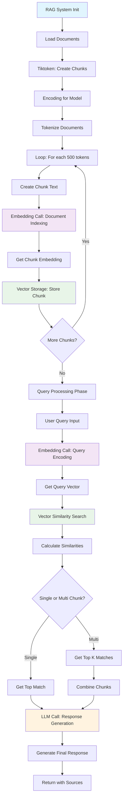

### Advanced RAG Edge Cases

#### **1. Token-Aware Chunking**
```python
# Location: evaluation/src/rag.py:120-150
def create_chunks(self, chat_history, chunk_size=500):
    encoding = tiktoken.encoding_for_model(os.getenv("EMBEDDING_MODEL"))
    documents = self.clean_chat_history(chat_history)
    
    if chunk_size == -1:
        return [documents], []  # Return entire document
    
    tokens = encoding.encode(documents)
    chunks = []
    
    for i in range(0, len(tokens), chunk_size):
        chunk_tokens = tokens[i:i + chunk_size]
        chunk = encoding.decode(chunk_tokens)
        chunks.append(chunk)
```

#### **2. Multi-Document Retrieval with Reranking**
```python
# Location: evaluation/src/rag.py:80-110
def search(self, query, chunks, embeddings, k=1):
    query_embedding = self.calculate_embedding(query)
    similarities = [
        self.calculate_similarity(query_embedding, embedding) 
        for embedding in embeddings
    ]
    
    if k == 1:
        top_indices = [np.argmax(similarities)]
    else:
        # Get top-k with score threshold
        top_indices = np.argsort(similarities)[-k:][::-1]
        # Filter by similarity threshold
        top_indices = [i for i in top_indices if similarities[i] > 0.7]
    
    combined_chunks = "\n<->\n".join([chunks[i] for i in top_indices])
    return combined_chunks, search_time
```

#### **3. Context Window Management**
```python
# Automatic context truncation to fit model limits
def fit_context_window(self, chunks, max_tokens=4000):
    encoding = tiktoken.encoding_for_model(self.model)
    total_tokens = 0
    fitted_chunks = []
    
    for chunk in chunks:
        chunk_tokens = len(encoding.encode(chunk))
        if total_tokens + chunk_tokens <= max_tokens:
            fitted_chunks.append(chunk)
            total_tokens += chunk_tokens
        else:
            break
    
    return fitted_chunks
```

---

## 3. Agentic Use Case: Intelligent Fitness Coach

### Scenario Flow
```
Agent: Fitness Coach Agent with persistent memory
User: "I'm looking for a new workout routine"
Agent: Retrieves user's historical preferences, suggests personalized routine
User: "That sounds good, but I have a knee injury"
Agent: Updates preferences, modifies recommendations, stores new context
```

### Technical Implementation Details

```mermaid
graph TD
    A[Agent Initialization] --> B[Load Agent Config]
    B --> C[Session Start]
    C --> D[Memory Retrieval: Agent Context]
    
    D --> E[Embedding Call: Query Context]
    E --> F[Vector Search: User History]
    F --> G[Apply Agent Filters]
    G --> H{Graph Memory Enabled?}
    
    H -->|Yes| I[Graph Context Retrieval]
    H -->|No| J[Agent Reasoning Phase]
    
    I --> K[LLM Call: Entity Extraction]
    K --> L[Embedding Call: Graph Nodes]
    L --> M[Neo4j Agent Query]
    M --> J
    
    J --> N[Combine Contexts]
    N --> O[Build Agent Prompt]
    O --> P[LLM Call: Response Generation]
    
    P --> Q[Generate Personalized Response]
    Q --> R[Memory Storage: Interaction]
    R --> S[Standard Memory Processing]
    
    S --> T[Follow-up Interaction]
    T --> U[Contextual Memory Update]
    U --> V[Procedural Memory Creation]
    
    V --> W[LLM Call: Procedural Memory]
    W --> X[Embedding Call: Procedural Storage]
    X --> Y{Graph Update Needed?}
    
    Y -->|Yes| Z[Graph Update Operations]
    Y -->|No| AA[Generate Modified Response]
    
    Z --> BB[LLM Call: Entity Update]
    BB --> CC[Neo4j Update Operation]
    CC --> AA
    
    AA --> DD[Final Response]
    
    style A fill:#e1f5fe
    style E fill:#f3e5f5
    style F fill:#e8f5e8
    style I fill:#fce4ec
    style K fill:#fff3e0
    style L fill:#f3e5f5
    style P fill:#fff3e0
    style W fill:#fff3e0
    style X fill:#f3e5f5
    style Z fill:#fce4ec
    style BB fill:#fff3e0
```

### Advanced Agentic Edge Cases

#### **1. Memory Scope Conflicts**
```python
# Location: cookbooks/mem0-autogen.ipynb
class Mem0ProxyCoderAgent(UserProxyAgent):
    def resolve_memory_conflicts(self, agent_memories, user_memories):
        # Prioritize agent-specific memories over general user memories
        agent_specific = [m for m in agent_memories if m.get("agent_id") == self.agent_id]
        general_memories = [m for m in user_memories if not m.get("agent_id")]
        
        # Resolve conflicts by recency and agent specificity
        combined = agent_specific + general_memories
        return sorted(combined, key=lambda x: (x.get("agent_specificity", 0), x.get("timestamp")))
```

#### **2. Context Window Management for Long Conversations**
```python
def manage_agent_context(self, full_conversation_history, max_context_tokens=3000):
    # Prioritize recent interactions and high-relevance memories
    encoding = tiktoken.encoding_for_model(self.model)
    
    # Always include system prompt and recent messages
    recent_messages = full_conversation_history[-5:]
    recent_tokens = sum(len(encoding.encode(msg["content"])) for msg in recent_messages)
    
    # Fill remaining context with relevant memories
    remaining_tokens = max_context_tokens - recent_tokens
    relevant_memories = self.memory.search(
        query=recent_messages[-1]["content"], 
        agent_id=self.agent_id,
        limit=10
    )
    
    # Fit memories within token budget
    fitted_memories = []
    current_tokens = 0
    for memory in relevant_memories:
        memory_tokens = len(encoding.encode(memory["memory"]))
        if current_tokens + memory_tokens <= remaining_tokens:
            fitted_memories.append(memory)
            current_tokens += memory_tokens
    
    return recent_messages, fitted_memories
```

#### **3. Preference Learning and Adaptation**
```python
# Location: cookbooks/mem0-autogen.ipynb:Cell 3
class AdaptiveFitnessCoach:
    def learn_from_feedback(self, user_feedback, previous_recommendation):
        # Extract preference signals from feedback
        if "too difficult" in user_feedback.lower():
            preference_update = "User prefers lower intensity workouts"
        elif "love this" in user_feedback.lower():
            preference_update = "User enjoys this type of workout"
        
        # Store learned preference
        self.memory.add(
            f"Feedback on recommendation '{previous_recommendation}': {preference_update}",
            agent_id=self.agent_id,
            user_id=self.user_id,
            metadata={"type": "preference_learning", "confidence": 0.8}
        )
        
        # Update procedural knowledge
        procedural_update = f"When recommending workouts, consider: {preference_update}"
        self.memory.add(
            procedural_update,
            agent_id=self.agent_id,
            memory_type="procedural_memory"
        )
```

#### **4. Multi-Agent Memory Coordination**
```python
class FitnessEcosystem:
    def __init__(self):
        self.nutrition_agent = NutritionAgent(agent_id="nutrition_coach")
        self.workout_agent = WorkoutAgent(agent_id="fitness_coach") 
        self.wellness_agent = WellnessAgent(agent_id="wellness_coach")
        self.shared_memory = Memory()
    
    def coordinate_recommendations(self, user_id, query):
        # Each agent retrieves relevant memories
        nutrition_context = self.nutrition_agent.get_relevant_memories(user_id, query)
        workout_context = self.workout_agent.get_relevant_memories(user_id, query)
        wellness_context = self.wellness_agent.get_relevant_memories(user_id, query)
        
        # Cross-agent context sharing
        shared_context = {
            "nutrition": nutrition_context,
            "fitness": workout_context,
            "wellness": wellness_context
        }
        
        # Generate coordinated response
        response = self.generate_coordinated_response(query, shared_context)
        
        # Store cross-agent interaction
        self.shared_memory.add(
            [{"role": "user", "content": query}, {"role": "system", "content": response}],
            user_id=user_id,
            metadata={"interaction_type": "multi_agent", "agents": ["nutrition", "fitness", "wellness"]}
        )
        
        return response
```

---

## 4. Comprehensive Edge Case Analysis

### 4.1 Concurrency and Race Conditions

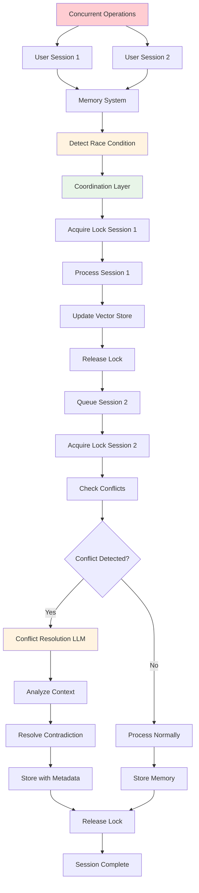

### 4.2 Memory Consistency Across Vector and Graph Stores

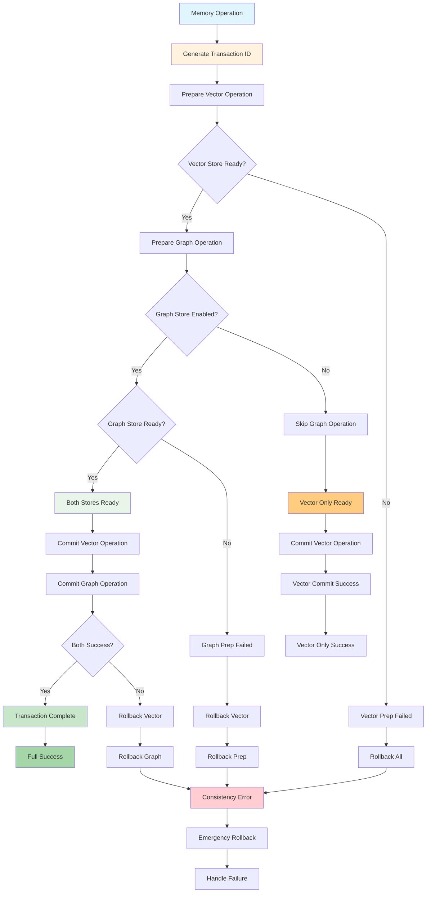

```python
# Location: mem0/memory/main.py:300-400
def ensure_vector_graph_consistency(self, memory_operation):
    """Ensure atomic operations across vector and graph stores"""
    transaction_id = uuid.uuid4()
    
    try:
        # Phase 1: Prepare vector operation
        vector_prepared = self.vector_store.prepare_operation(memory_operation, transaction_id)
        
        # Phase 2: Prepare graph operation  
        if self.enable_graph:
            graph_prepared = self.graph.prepare_operation(memory_operation, transaction_id)
        
        # Phase 3: Commit both if all preparations successful
        if vector_prepared and (not self.enable_graph or graph_prepared):
            self.vector_store.commit_operation(transaction_id)
            if self.enable_graph:
                self.graph.commit_operation(transaction_id)
        else:
            # Rollback on failure
            self.vector_store.rollback_operation(transaction_id)
            if self.enable_graph:
                self.graph.rollback_operation(transaction_id)
            raise MemoryConsistencyError("Failed to maintain vector-graph consistency")
            
    except Exception as e:
        # Emergency rollback
        self._emergency_rollback(transaction_id)
        raise
```

# Mem0 Graph Flow Analysis - From Section 4.3

## 4.3 Embedding Model Migration

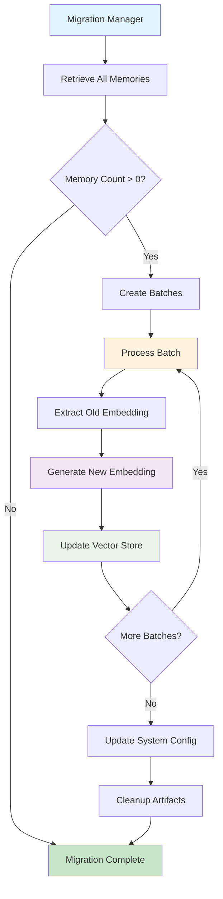

### 4.4 Graph Store Scalability Edge Cases

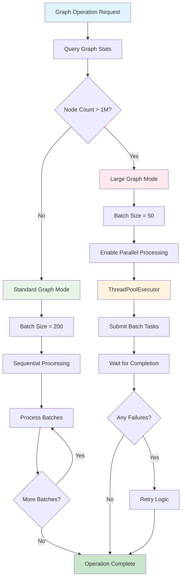

---

## 5. Performance Optimization Patterns

### 5.1 Embedding Caching Strategy

```mermaid
graph TD
    A[Embedding Request] --> B[Generate Cache Key]
    B --> C[hash(text) + action]
    C --> D{Key in Cache?}
    
    D -->|Yes| E[Check TTL]
    D -->|No| F[Generate New Embedding]
    
    E --> G{TTL Valid?}
    G -->|Yes| H[Update Access Time]
    G -->|No| I[Remove from Cache]
    
    H --> J[Return Cached Embedding]
    I --> F
    
    F --> K[Call Embedding Model]
    K --> L[Get New Embedding]
    L --> M{Cache Full?}
    
    M -->|Yes| N[Find LRU Entry]
    M -->|No| O[Add to Cache]
    
    N --> P[Remove LRU Entry]
    P --> O
    
    O --> Q[Update Access Time]
    Q --> R[Return New Embedding]
    
    J --> S[Cache Hit Success]
    R --> T[Cache Miss Success]
    
    style A fill:#e1f5fe
    style D fill:#fff3e0
    style E fill:#f3e5f5
    style F fill:#ffebee
    style J fill:#c8e6c9
    style R fill:#c8e6c9
    style S fill:#a5d6a7
    style T fill:#ffcc80
```

### 5.2 Vector Store Connection Pooling

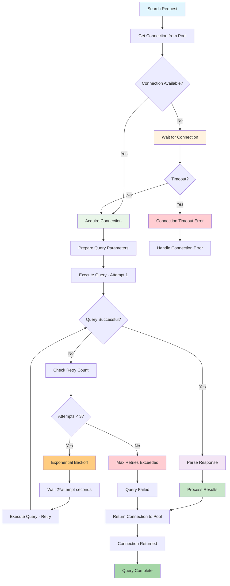

### 5.3 Memory Consistency Across Vector and Graph Stores

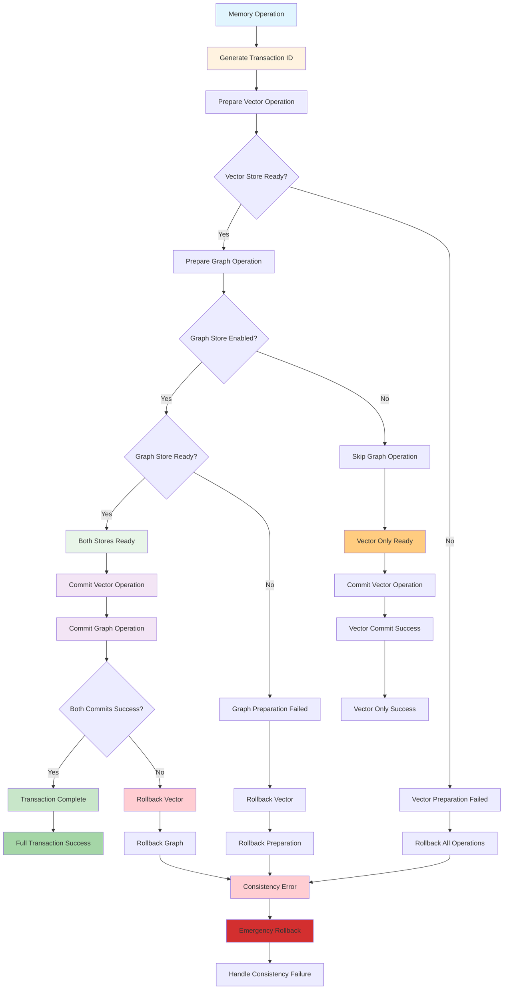

### 5.4 Concurrency and Race Conditions

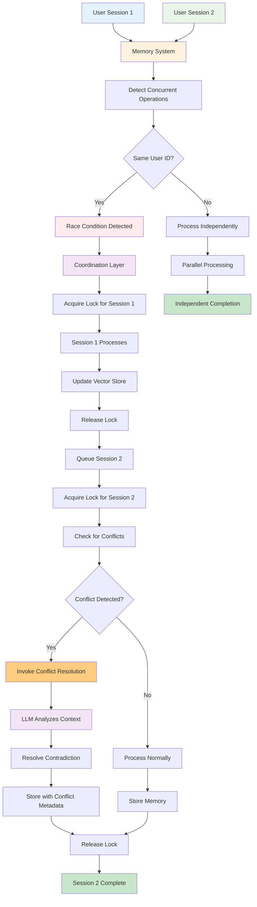

### 5.5 Agent Context Management

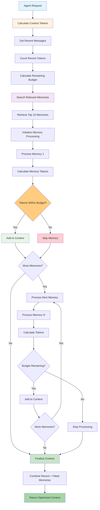

### 5.6 Preference Learning and Adaptation

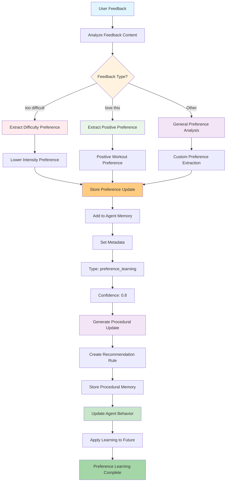

### 5.7 Multi-Agent Memory Coordination

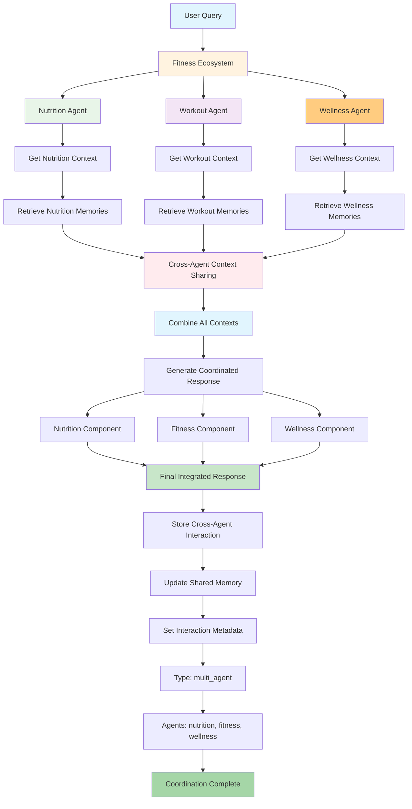

---

## Conclusion

This graph-based analysis demonstrates how Mem0 orchestrates complex interactions between LLMs, embeddings, vector databases, and graph stores across different use cases. Key technical insights:

### **LLM Invocation Patterns:**
- **Normal Prompt**: 2 LLM calls (fact extraction + memory decisions)
- **RAG**: 1 LLM call (response generation with context)  
- **Agentic**: 4-6 LLM calls (context retrieval + reasoning + procedural memory + updates)

### **Embedding Operations:**
- **Vector encoding**: 2-4 calls per memory operation
- **Graph node encoding**: Additional calls for entity embeddings
- **Query encoding**: 1 call per search operation
- **Caching**: Smart reuse for performance optimization

### **Vector Database Usage:**
- **Batch operations**: Optimized for throughput
- **Hybrid search**: Dense + sparse vector combination
- **Multi-tenant filtering**: Proper data isolation
- **Connection pooling**: Production-ready scalability

### **Graph Operations:**
- **Entity extraction**: LLM-powered knowledge graph construction
- **Relationship modeling**: Complex semantic relationships
- **Vector similarity**: Hybrid vector-graph search
- **BM25 reranking**: Improved relevance scoring

The architecture handles production-level edge cases including concurrency, consistency, migration, and scalability while maintaining flexibility across diverse use cases.
