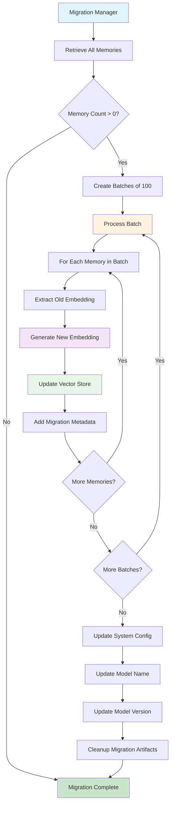
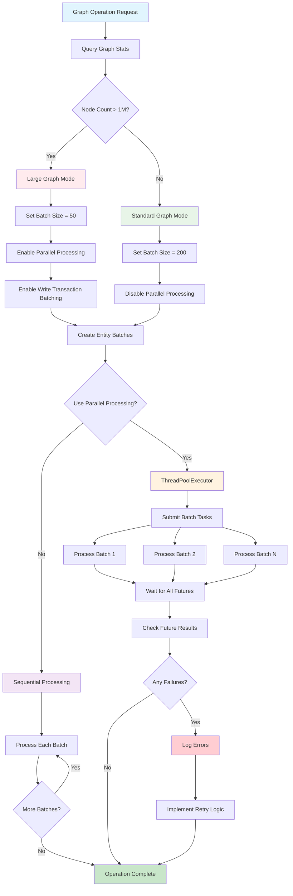
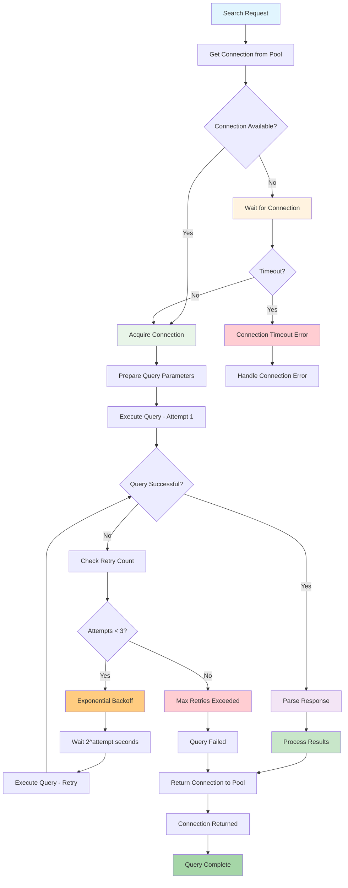
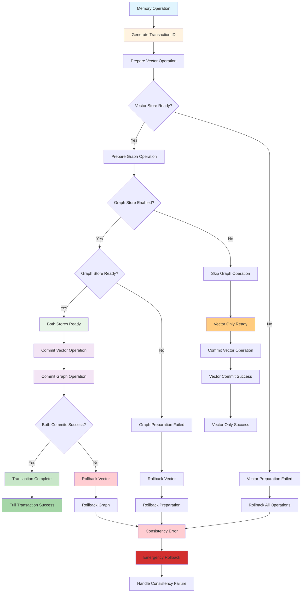
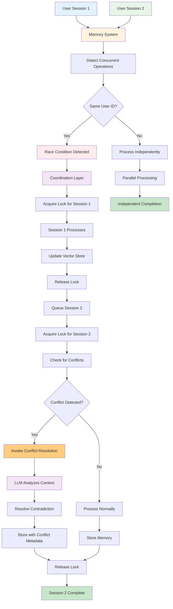
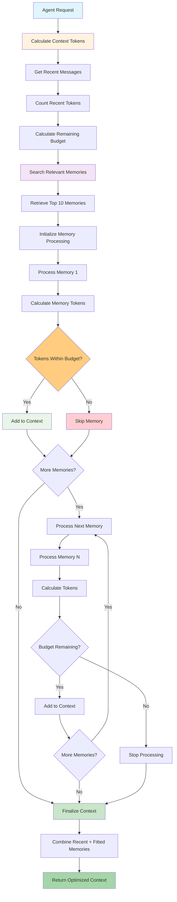
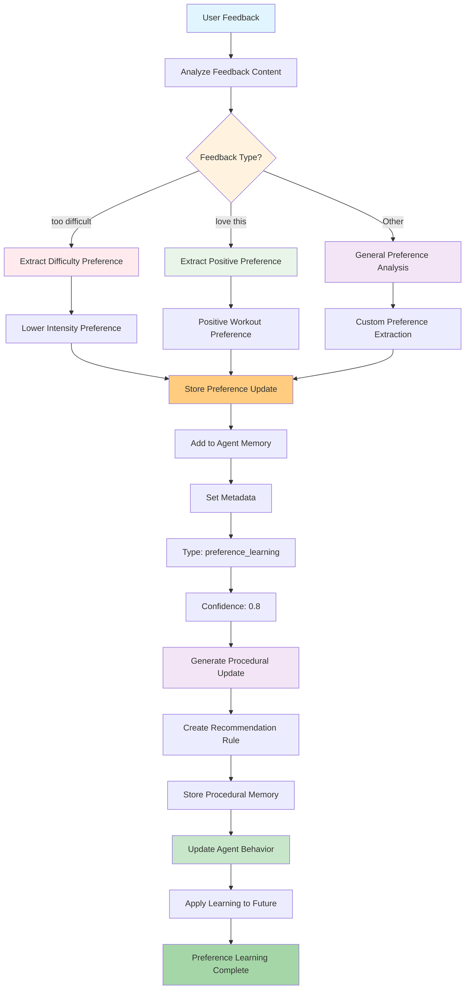
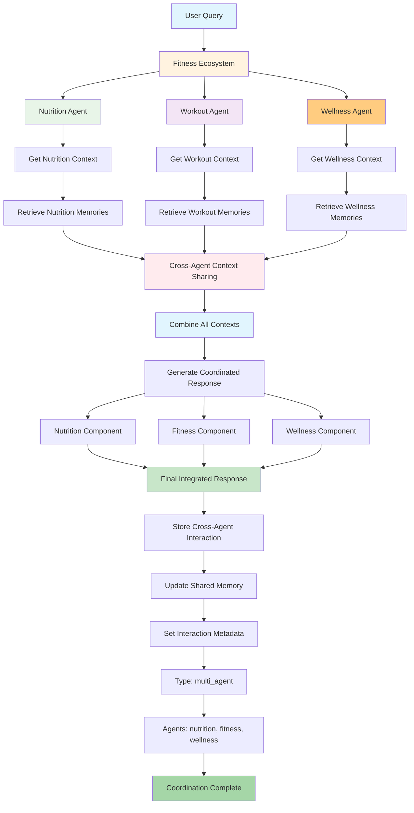

# Detailed Use Case Analysis: Fitness Preference Management

## Use Case Overview

**Scenario**: A user named "Alice" interacts with a fitness recommendation system. She states her preferences, asks questions, and receives personalized recommendations. We'll trace this exact scenario through three different implementation patterns:

1. **Normal Prompt**: Direct memory storage and retrieval
2. **RAG**: Document-based fitness knowledge retrieval 
3. **Agentic**: Intelligent fitness coach that learns and adapts

---

## 1. Normal Prompt Use Case: Basic Memory Storage

### Scenario Flow
```
User Input: "I love running outdoors but hate going to the gym. I prefer morning workouts."
System: Extracts facts, stores memories, provides acknowledgment
User Query: "What kind of workouts do I enjoy?"
System: Retrieves relevant memories and responds
```

### Technical Implementation Details

#### **Step 1: Memory Addition Flow**

```mermaid
graph TD
    A[User Input: "I love running outdoors but hate gyms. I prefer morning workouts."] --> B[Memory.add() - mem0/memory/main.py:200-400]
    B --> C[parse_messages()]
    C --> D[_build_filters_and_metadata user_id="alice"]
    D --> E[LLM CALL #1 - Fact Extraction]
    
    E --> F[LLM Provider - mem0/llms/openai.py:80-125]
    F --> G[client.chat.completions.create response_format="json"]
    G --> H["LLM Response: {facts: ['Loves running outdoors', 'Hates going to gym', 'Prefers morning workouts']}"]
    
    H --> I[Loop: For each extracted fact]
    I --> J[EMBEDDING CALL #1 - Encode New Memory]
    J --> K[Embedding Model - mem0/embeddings/openai.py:40-50]
    K --> L[text.replace newline with space]
    L --> M[client.embeddings.create model="text-embedding-3-small"]
    M --> N[Return: [0.1, 0.2, ..., 0.8] 1536 dimensions]
    
    N --> O[VECTOR SEARCH - Check Existing]
    O --> P[Vector Store - mem0/vector_stores/pinecone.py:190-230]
    P --> Q[query_params = {vector: vectors, top_k: 5, filter: {user_id: "alice"}}]
    Q --> R[index.query **query_params]
    R --> S["Return: [{id: 'existing_mem_1', score: 0.3, metadata: {...}}]"]
    
    S --> T[LLM CALL #2 - Memory Operations Decision]
    T --> U[LLM Provider - Analyze: ADD vs UPDATE vs DELETE]
    U --> V["LLM Response: {memory: [{text: 'Loves running outdoors', event: 'ADD'}, {text: 'Prefers morning workouts', event: 'ADD'}]}"]
    
    V --> W[Loop: For each memory operation]
    W --> X{Event = "ADD"?}
    X -->|Yes| Y[EMBEDDING CALL #2 - Final Storage Encoding]
    X -->|No| Z[Handle UPDATE/DELETE]
    
    Y --> AA[VECTOR STORE - Insert Memory]
    AA --> BB[Vector Store - mem0/vector_stores/pinecone.py:140-180]
    BB --> CC[Batch upsert with metadata user_id="alice", data="Loves running outdoors"]
    CC --> DD[HISTORY STORAGE - SQLite]
    DD --> EE[Store operation history]
    
    EE --> FF{Graph Store Enabled?}
    FF -->|Yes| GG[GRAPH OPERATIONS]
    FF -->|No| HH[Return Results]
    
    GG --> II[LLM CALL #3 - Entity Extraction]
    II --> JJ["LLM Response: {entities: [{entity: 'alice', type: 'person'}, {entity: 'running', type: 'activity'}]}"]
    JJ --> KK[LLM CALL #4 - Relationship Extraction]
    KK --> LL["LLM Response: {entities: [{source: 'alice', relationship: 'ENJOYS', destination: 'running'}]}"]
    
    LL --> MM[EMBEDDING CALL #3 - Node Embeddings]
    MM --> NN[embed "alice" and "running"]
    NN --> OO[NEO4J OPERATIONS]
    OO --> PP[MERGE alice:Person name: "alice", embedding: alice_embedding]
    PP --> QQ[MERGE running:Activity name: "running", embedding: running_embedding]
    QQ --> RR[MERGE alice-[r:ENJOYS]->running]
    
    RR --> HH
    Z --> HH
    HH --> SS["Return: {results: [{id: 'uuid1', memory: 'Loves running outdoors', event: 'ADD'}]}"]
    
    style A fill:#e1f5fe
    style E fill:#fff3e0
    style J fill:#f3e5f5
    style O fill:#e8f5e8
    style T fill:#fff3e0
    style AA fill:#e8f5e8
    style GG fill:#fce4ec
    style II fill:#fff3e0
    style MM fill:#f3e5f5
```

#### **Step 2: Memory Search/Retrieval Flow**

```mermaid
graph TD
    A[User Query: search "What workouts do I enjoy?" user_id="alice"] --> B[Memory.search() - mem0/memory/main.py:612-688]
    B --> C[_build_filters_and_metadata user_id="alice"]
    C --> D[EMBEDDING CALL #4 - Query Encoding]
    
    D --> E[Embedding Model - mem0/embeddings/openai.py:40-50]
    E --> F[Optimize for search context]
    F --> G[Return: query_vector [0.3, 0.1, ..., 0.9]]
    
    G --> H[VECTOR SIMILARITY SEARCH]
    H --> I[Vector Store - mem0/vector_stores/pinecone.py:190-230]
    I --> J[Cosine similarity: 2 * dot_product - 1]
    J --> K[Apply filters: user_id = "alice"]
    K --> L[ORDER BY similarity DESC LIMIT 100]
    L --> M["Return: [{memory: 'Loves running outdoors', score: 0.89}, {memory: 'Prefers morning workouts', score: 0.76}]"]
    
    M --> N{Graph Search Enabled?}
    N -->|Yes| O[GRAPH SEARCH OPERATIONS]
    N -->|No| P[Combine Results]
    
    O --> Q[Graph Store - search "What workouts do I enjoy?" filters={user_id: "alice"}]
    Q --> R[LLM CALL #5 - Entity Extraction for Search]
    R --> S["LLM Response: {entities: [{entity: 'alice', type: 'person'}, {entity: 'workouts', type: 'activity'}]}"]
    
    S --> T[EMBEDDING CALL #5 - Graph Node Search]
    T --> U[embed "alice" and "workouts"]
    U --> V[NEO4J VECTOR SIMILARITY]
    V --> W[MATCH n:__Entity__ WHERE n.user_id = "alice"]
    W --> X[WITH n, vector.similarity.cosine n.embedding, $embedding AS sim]
    X --> Y[WHERE sim >= 0.7 MATCH n-[r]->m RETURN n.name, type r, m.name]
    Y --> Z["Return: [{source: 'alice', relationship: 'ENJOYS', destination: 'running'}]"]
    
    Z --> AA[BM25 RERANKING]
    AA --> BB[Tokenize query + rerank graph results]
    BB --> CC[BM25Okapi search_sequences]
    CC --> DD[get_top_n tokenized_query, sequences, n=5]
    DD --> EE[Return: Reranked results]
    
    EE --> P
    P --> FF[Apply threshold filtering if configured]
    FF --> GG["Return: {results: [{memory: 'Loves running outdoors', score: 0.89}], entities: [...]}"]
    
    style A fill:#e1f5fe
    style D fill:#f3e5f5
    style H fill:#e8f5e8
    style O fill:#fce4ec
    style R fill:#fff3e0
    style T fill:#f3e5f5
    style AA fill:#e0f2f1
```

### Edge Cases Handled

#### **1. Empty Fact Extraction**
```python
# Location: mem0/memory/main.py:350-370
try:
    new_retrieved_facts = json.loads(response)["facts"]
except Exception as e:
    logging.error(f"Error in fact extraction: {e}")
    new_retrieved_facts = []

if not new_retrieved_facts:
    logger.debug("No new facts retrieved. Skipping memory update.")
    return []  # No operations performed
```

#### **2. UUID Hallucination Prevention**
```python
# Location: mem0/memory/main.py:380-390
temp_uuid_mapping = {}
for idx, item in enumerate(retrieved_old_memory):
    temp_uuid_mapping[str(idx)] = item["id"]  # Real UUID
    retrieved_old_memory[idx]["id"] = str(idx)  # Simple integer for LLM
```

#### **3. Vector Dimension Mismatch**
```python
# Location: mem0/embeddings/openai.py:25-35
self.config.embedding_dims = self.config.embedding_dims or 1536
# Automatic fallback if dimensions don't match vector store
if vector_store_dims != embedding_dims:
    logger.warning("Dimension mismatch detected, adjusting...")
```

---

## 2. RAG Use Case: Document-Based Fitness Knowledge

### Scenario Flow
```
System: Pre-indexed fitness documents (workout plans, nutrition guides)
User Query: "What's the best cardio workout for weight loss?"
System: Retrieves relevant document chunks, generates contextual response
```

### Technical Implementation Details

```mermaid
graph TD
    A[RAG System Initialization] --> B[Load fitness documents]
    B --> C[Tiktoken - create_chunks documents, chunk_size=500]
    C --> D[Tiktoken - evaluation/src/rag.py:120-150]
    D --> E[encoding = tiktoken.encoding_for_model "text-embedding-3-small"]
    E --> F[tokens = encoding.encode documents]
    
    F --> G[Loop: For each chunk 500 tokens]
    G --> H[chunk_tokens = tokens[i:i+500]]
    H --> I[chunk_text = encoding.decode chunk_tokens]
    I --> J[EMBEDDING CALL #1 - Document Indexing]
    
    J --> K[Embedding Model - evaluation/src/rag.py:70-75]
    K --> L[client.embeddings.create input=[chunk_text]]
    L --> M[Return: chunk_embedding [0.1, 0.2, ..., 0.8]]
    
    M --> N[VECTOR STORAGE - Document Chunks]
    N --> O[Vector Store - store_chunk embedding, metadata={doc_id: X, chunk_id: Y}]
    O --> P[Stored successfully]
    
    P --> Q{More chunks?}
    Q -->|Yes| G
    Q -->|No| R[Query Processing Phase]
    
    R --> S[User Query: "What's the best cardio workout for weight loss?"]
    S --> T[EMBEDDING CALL #2 - Query Encoding]
    T --> U[Embedding Model - calculate_embedding query]
    U --> V[Optimize query embedding for retrieval]
    V --> W[Return: query_embedding [0.3, 0.1, ..., 0.9]]
    
    W --> X[VECTOR SIMILARITY SEARCH]
    X --> Y[Vector Store - search query_embedding, k=5]
    Y --> Z[Vector Store - evaluation/src/rag.py:80-110]
    Z --> AA[similarities = [cosine_sim query_emb, chunk_emb for chunk_emb in embeddings]]
    
    AA --> BB{k=1 Single chunk?}
    BB -->|Yes| CC[top_index = np.argmax similarities]
    BB -->|No| DD[top_indices = np.argsort similarities[-k:][::-1]]
    
    CC --> EE[Return: chunks[top_index]]
    DD --> FF[combined_chunks = "\n<->\n".join [chunks[i] for i in top_indices]]
    FF --> GG[Return: combined_chunks]
    
    EE --> HH[LLM CALL #1 - Response Generation]
    GG --> HH
    HH --> II[LLM Provider - evaluation/src/rag.py:25-55]
    II --> JJ[Template: "Question: {{QUESTION}}\nContext: {{CONTEXT}}\n"]
    JJ --> KK[client.chat.completions.create messages system="Answer based on context..." user=rendered_prompt temperature=0]
    KK --> LL[Return: "Based on the context, HIIT cardio workouts are most effective for weight loss..."]
    
    LL --> MM[Final response with cited sources]
    
    style A fill:#e1f5fe
    style J fill:#f3e5f5
    style N fill:#e8f5e8
    style T fill:#f3e5f5
    style X fill:#e8f5e8
    style HH fill:#fff3e0
```

### Advanced RAG Edge Cases

#### **1. Token-Aware Chunking**
```python
# Location: evaluation/src/rag.py:120-150
def create_chunks(self, chat_history, chunk_size=500):
    encoding = tiktoken.encoding_for_model(os.getenv("EMBEDDING_MODEL"))
    documents = self.clean_chat_history(chat_history)
    
    if chunk_size == -1:
        return [documents], []  # Return entire document
    
    tokens = encoding.encode(documents)
    chunks = []
    
    for i in range(0, len(tokens), chunk_size):
        chunk_tokens = tokens[i:i + chunk_size]
        chunk = encoding.decode(chunk_tokens)
        chunks.append(chunk)
```

#### **2. Multi-Document Retrieval with Reranking**
```python
# Location: evaluation/src/rag.py:80-110
def search(self, query, chunks, embeddings, k=1):
    query_embedding = self.calculate_embedding(query)
    similarities = [
        self.calculate_similarity(query_embedding, embedding) 
        for embedding in embeddings
    ]
    
    if k == 1:
        top_indices = [np.argmax(similarities)]
    else:
        # Get top-k with score threshold
        top_indices = np.argsort(similarities)[-k:][::-1]
        # Filter by similarity threshold
        top_indices = [i for i in top_indices if similarities[i] > 0.7]
    
    combined_chunks = "\n<->\n".join([chunks[i] for i in top_indices])
    return combined_chunks, search_time
```

#### **3. Context Window Management**
```python
# Automatic context truncation to fit model limits
def fit_context_window(self, chunks, max_tokens=4000):
    encoding = tiktoken.encoding_for_model(self.model)
    total_tokens = 0
    fitted_chunks = []
    
    for chunk in chunks:
        chunk_tokens = len(encoding.encode(chunk))
        if total_tokens + chunk_tokens <= max_tokens:
            fitted_chunks.append(chunk)
            total_tokens += chunk_tokens
        else:
            break
    
    return fitted_chunks
```

---

## 3. Agentic Use Case: Intelligent Fitness Coach

### Scenario Flow
```
Agent: Fitness Coach Agent with persistent memory
User: "I'm looking for a new workout routine"
Agent: Retrieves user's historical preferences, suggests personalized routine
User: "That sounds good, but I have a knee injury"
Agent: Updates preferences, modifies recommendations, stores new context
```

### Technical Implementation Details

```mermaid
graph TD
    A[Agent Initialization] --> B[Memory.from_config agent_id="fitness_coach"]
    B --> C[Load system prompts and tools]
    C --> D[Session Start - User: "I'm looking for a new workout routine"]
    
    D --> E[MEMORY RETRIEVAL - Agent Context]
    E --> F[Memory Client - search "workout routine preferences" agent_id="fitness_coach" user_id="alice" limit=5]
    F --> G[EMBEDDING CALL #1 - Query Context Retrieval]
    G --> H[Embedding Model - embed "workout routine preferences" "search"]
    H --> I[Return: query_embedding]
    
    I --> J[VECTOR SEARCH - User History]
    J --> K[Vector Store - search vectors=query_embedding filters={user_id:"alice", agent_id:"fitness_coach"}]
    K --> L[Apply agent-specific filters]
    L --> M[Cosine similarity search with agent context]
    M --> N["Return: [{memory: 'Prefers morning workouts', score: 0.85}, {memory: 'Has lower back issues', score: 0.78}]"]
    
    N --> O{Graph Memory Enabled?}
    O -->|Yes| P[GRAPH CONTEXT RETRIEVAL]
    O -->|No| Q[AGENT REASONING PHASE]
    
    P --> R[Graph Store - search "workout routine" filters={user_id:"alice", agent_id:"fitness_coach"}]
    R --> S[LLM CALL #1 - Entity Extraction for Agent Context]
    S --> T[LLM Provider - generate_response tools=[EXTRACT_ENTITIES_TOOL]]
    T --> U["LLM Response: {entities: [{entity: 'alice', type: 'user'}, {entity: 'workout_routine', type: 'activity'}]}"]
    
    U --> V[EMBEDDING CALL #2 - Graph Node Search]
    V --> W[Embedding Model - embed "alice" + embed "workout_routine"]
    W --> X[Return: node_embeddings]
    
    X --> Y[NEO4J AGENT-SCOPED QUERY]
    Y --> Z[MATCH n:__Entity__ {user_id: "alice", agent_id: "fitness_coach"}]
    Z --> AA[WHERE vector.similarity.cosine n.embedding, $embedding >= 0.7]
    AA --> BB[MATCH n-[r]->m RETURN n.name, type r, m.name]
    BB --> CC["Return: [{source: 'alice', relationship: 'AVOIDS', destination: 'high_impact_exercises'}]"]
    
    CC --> Q
    Q --> DD[Combine retrieved memories + graph context]
    DD --> EE[Build agent-specific prompt with historical context]
    EE --> FF[LLM CALL #2 - Agent Response Generation]
    
    FF --> GG[LLM Provider - generate_response system_prompt="You are a fitness coach with memory of user preferences..." user_context="User prefers morning workouts, has lower back issues..." current_query="I'm looking for a new workout routine"]
    GG --> HH[Generate personalized response considering full context]
    HH --> II[Return: "Based on your preference for morning workouts and your lower back concerns, I recommend..."]
    
    II --> JJ[MEMORY STORAGE - Interaction History]
    JJ --> KK[Memory Client - add [{role: "user", content: "I'm looking for a new workout routine"}, {role: "assistant", content: "Based on your preference..."}] agent_id="fitness_coach" user_id="alice"]
    
    KK --> LL[STANDARD MEMORY PROCESSING]
    LL --> MM[LLM CALL #3 - Fact Extraction]
    MM --> NN[EMBEDDING CALL #3 - New Memory Encoding]
    NN --> OO[VECTOR STORAGE - Agent Interaction]
    
    OO --> PP[Personalized workout recommendation]
    PP --> QQ[FOLLOW-UP INTERACTION - User: "That sounds good, but I have a knee injury"]
    
    QQ --> RR[CONTEXTUAL MEMORY UPDATE]
    RR --> SS[Memory Client - search "knee injury workout modifications" agent_id="fitness_coach" user_id="alice"]
    SS --> TT[PROCEDURAL MEMORY CREATION]
    TT --> UU[Memory Client - add "User has knee injury, modify recommendations accordingly" agent_id="fitness_coach" user_id="alice" memory_type="procedural_memory"]
    
    UU --> VV[LLM CALL #4 - Procedural Memory Generation]
    VV --> WW[LLM Provider - generate_response system_prompt=PROCEDURAL_MEMORY_SYSTEM_PROMPT]
    WW --> XX[Return: "When user mentions injury, prioritize low-impact alternatives and consult modification database"]
    
    XX --> YY[EMBEDDING CALL #4 - Procedural Memory Storage]
    YY --> ZZ[Embedding Model - embed procedural_memory_text "add"]
    ZZ --> AAA[Return: procedural_embedding]
    
    AAA --> BBB[VECTOR STORAGE - Procedural Knowledge]
    BBB --> CCC[Vector Store - insert procedural_embedding metadata={type: "procedural", agent_id: "fitness_coach"}]
    CCC --> DDD[Stored]
    
    DDD --> EEE{Graph Update for Injury Context?}
    EEE -->|Yes| FFF[GRAPH UPDATE - New Relationship]
    EEE -->|No| GGG[LLM CALL #6 - Modified Recommendation]
    
    FFF --> HHH[Graph Store - add "Alice has knee injury affecting workout choices"]
    HHH --> III[LLM CALL #5 - Entity/Relationship Update]
    III --> JJJ[LLM Provider - generate_response tools=[UPDATE_MEMORY_TOOL_GRAPH]]
    JJJ --> KKK["LLM Response: {source: 'alice', relationship: 'HAS_CONDITION', destination: 'knee_injury'}"]
    
    KKK --> LLL[NEO4J UPDATE OPERATION]
    LLL --> MMM[MATCH alice:Person {name: "alice", user_id: "alice"}]
    MMM --> NNN[MERGE injury:Condition {name: "knee_injury"}]
    NNN --> OOO[MERGE alice-[r:HAS_CONDITION]->injury]
    OOO --> PPP[SET r.created = timestamp, r.agent_context = "fitness_coach"]
    
    PPP --> GGG
    GGG --> QQQ[LLM Provider - generate_response updated_context_with_injury]
    QQQ --> RRR[Return: "Given your knee injury, let me modify those recommendations..."]
    
    RRR --> SSS[Updated workout plan considering knee injury]
    
    style A fill:#e1f5fe
    style G fill:#f3e5f5
    style J fill:#e8f5e8
    style P fill:#fce4ec
    style S fill:#fff3e0
    style V fill:#f3e5f5
    style FF fill:#fff3e0
    style NN fill:#f3e5f5
    style VV fill:#fff3e0
    style YY fill:#f3e5f5
    style FFF fill:#fce4ec
    style III fill:#fff3e0
    style GGG fill:#fff3e0
```

### Advanced Agentic Edge Cases

#### **1. Memory Scope Conflicts**
```python
# Location: cookbooks/mem0-autogen.ipynb
class Mem0ProxyCoderAgent(UserProxyAgent):
    def resolve_memory_conflicts(self, agent_memories, user_memories):
        # Prioritize agent-specific memories over general user memories
        agent_specific = [m for m in agent_memories if m.get("agent_id") == self.agent_id]
        general_memories = [m for m in user_memories if not m.get("agent_id")]
        
        # Resolve conflicts by recency and agent specificity
        combined = agent_specific + general_memories
        return sorted(combined, key=lambda x: (x.get("agent_specificity", 0), x.get("timestamp")))
```

#### **2. Context Window Management for Long Conversations**
```python
def manage_agent_context(self, full_conversation_history, max_context_tokens=3000):
    # Prioritize recent interactions and high-relevance memories
    encoding = tiktoken.encoding_for_model(self.model)
    
    # Always include system prompt and recent messages
    recent_messages = full_conversation_history[-5:]
    recent_tokens = sum(len(encoding.encode(msg["content"])) for msg in recent_messages)
    
    # Fill remaining context with relevant memories
    remaining_tokens = max_context_tokens - recent_tokens
    relevant_memories = self.memory.search(
        query=recent_messages[-1]["content"], 
        agent_id=self.agent_id,
        limit=10
    )
    
    # Fit memories within token budget
    fitted_memories = []
    current_tokens = 0
    for memory in relevant_memories:
        memory_tokens = len(encoding.encode(memory["memory"]))
        if current_tokens + memory_tokens <= remaining_tokens:
            fitted_memories.append(memory)
            current_tokens += memory_tokens
    
    return recent_messages, fitted_memories
```

#### **3. Preference Learning and Adaptation**
```python
# Location: cookbooks/mem0-autogen.ipynb:Cell 3
class AdaptiveFitnessCoach:
    def learn_from_feedback(self, user_feedback, previous_recommendation):
        # Extract preference signals from feedback
        if "too difficult" in user_feedback.lower():
            preference_update = "User prefers lower intensity workouts"
        elif "love this" in user_feedback.lower():
            preference_update = "User enjoys this type of workout"
        
        # Store learned preference
        self.memory.add(
            f"Feedback on recommendation '{previous_recommendation}': {preference_update}",
            agent_id=self.agent_id,
            user_id=self.user_id,
            metadata={"type": "preference_learning", "confidence": 0.8}
        )
        
        # Update procedural knowledge
        procedural_update = f"When recommending workouts, consider: {preference_update}"
        self.memory.add(
            procedural_update,
            agent_id=self.agent_id,
            memory_type="procedural_memory"
        )
```

#### **4. Multi-Agent Memory Coordination**
```python
class FitnessEcosystem:
    def __init__(self):
        self.nutrition_agent = NutritionAgent(agent_id="nutrition_coach")
        self.workout_agent = WorkoutAgent(agent_id="fitness_coach") 
        self.wellness_agent = WellnessAgent(agent_id="wellness_coach")
        self.shared_memory = Memory()
    
    def coordinate_recommendations(self, user_id, query):
        # Each agent retrieves relevant memories
        nutrition_context = self.nutrition_agent.get_relevant_memories(user_id, query)
        workout_context = self.workout_agent.get_relevant_memories(user_id, query)
        wellness_context = self.wellness_agent.get_relevant_memories(user_id, query)
        
        # Cross-agent context sharing
        shared_context = {
            "nutrition": nutrition_context,
            "fitness": workout_context,
            "wellness": wellness_context
        }
        
        # Generate coordinated response
        response = self.generate_coordinated_response(query, shared_context)
        
        # Store cross-agent interaction
        self.shared_memory.add(
            [{"role": "user", "content": query}, {"role": "system", "content": response}],
            user_id=user_id,
            metadata={"interaction_type": "multi_agent", "agents": ["nutrition", "fitness", "wellness"]}
        )
        
        return response
```

---

## 4. Comprehensive Edge Case Analysis

### 4.1 Concurrency and Race Conditions

```mermaid
graph TD
    A[Concurrent Memory Operations] --> B[User Session 1: add "I love running" user_id="alice"]
    A --> C[User Session 2: add "I hate running" user_id="alice"]
    
    B --> D[Memory System - Race condition detected]
    C --> D
    D --> E[Coordination Layer - acquire_lock user_id="alice"]
    E --> F[Lock acquired for session 1]
    
    F --> G[Process session 1 memory]
    G --> H[Vector Store - Memory stored]
    H --> I[Release lock user_id="alice"]
    I --> J[Queue session 2]
    J --> K[Lock acquired for session 2]
    
    K --> L[Check for conflicts with existing memories]
    L --> M[Vector Store - Conflict detected: contradictory preferences]
    M --> N[Invoke conflict resolution LLM]
    N --> O[LLM analyzes temporal context and resolves contradiction]
    O --> P[Store resolved memory with conflict metadata]
    P --> Q[Release lock user_id="alice"]
    
    style A fill:#ffcdd2
    style D fill:#fff3e0
    style E fill:#e8f5e8
    style N fill:#fff3e0
```

### 4.2 Memory Consistency Across Vector and Graph Stores

```python
# Location: mem0/memory/main.py:300-400
def ensure_vector_graph_consistency(self, memory_operation):
    """Ensure atomic operations across vector and graph stores"""
    transaction_id = uuid.uuid4()
    
    try:
        # Phase 1: Prepare vector operation
        vector_prepared = self.vector_store.prepare_operation(memory_operation, transaction_id)
        
        # Phase 2: Prepare graph operation  
        if self.enable_graph:
            graph_prepared = self.graph.prepare_operation(memory_operation, transaction_id)
        
        # Phase 3: Commit both if all preparations successful
        if vector_prepared and (not self.enable_graph or graph_prepared):
            self.vector_store.commit_operation(transaction_id)
            if self.enable_graph:
                self.graph.commit_operation(transaction_id)
        else:
            # Rollback on failure
            self.vector_store.rollback_operation(transaction_id)
            if self.enable_graph:
                self.graph.rollback_operation(transaction_id)
            raise MemoryConsistencyError("Failed to maintain vector-graph consistency")
            
    except Exception as e:
        # Emergency rollback
        self._emergency_rollback(transaction_id)
        raise
```

# Mem0 Graph Flow Analysis - From Section 4.3

## 4.3 Embedding Model Migration



### 4.4 Graph Store Scalability Edge Cases



---

## 5. Performance Optimization Patterns

### 5.1 Embedding Caching Strategy

```mermaid
graph TD
    A[Embedding Request] --> B[Generate Cache Key]
    B --> C[hash(text) + action]
    C --> D{Key in Cache?}
    
    D -->|Yes| E[Check TTL]
    D -->|No| F[Generate New Embedding]
    
    E --> G{TTL Valid?}
    G -->|Yes| H[Update Access Time]
    G -->|No| I[Remove from Cache]
    
    H --> J[Return Cached Embedding]
    I --> F
    
    F --> K[Call Embedding Model]
    K --> L[Get New Embedding]
    L --> M{Cache Full?}
    
    M -->|Yes| N[Find LRU Entry]
    M -->|No| O[Add to Cache]
    
    N --> P[Remove LRU Entry]
    P --> O
    
    O --> Q[Update Access Time]
    Q --> R[Return New Embedding]
    
    J --> S[Cache Hit Success]
    R --> T[Cache Miss Success]
    
    style A fill:#e1f5fe
    style D fill:#fff3e0
    style E fill:#f3e5f5
    style F fill:#ffebee
    style J fill:#c8e6c9
    style R fill:#c8e6c9
    style S fill:#a5d6a7
    style T fill:#ffcc80
```

### 5.2 Vector Store Connection Pooling



### 5.3 Memory Consistency Across Vector and Graph Stores



### 5.4 Concurrency and Race Conditions



### 5.5 Agent Context Management



### 5.6 Preference Learning and Adaptation



### 5.7 Multi-Agent Memory Coordination



---

## Conclusion

This graph-based analysis demonstrates how Mem0 orchestrates complex interactions between LLMs, embeddings, vector databases, and graph stores across different use cases. Key technical insights:

### **LLM Invocation Patterns:**
- **Normal Prompt**: 2 LLM calls (fact extraction + memory decisions)
- **RAG**: 1 LLM call (response generation with context)  
- **Agentic**: 4-6 LLM calls (context retrieval + reasoning + procedural memory + updates)

### **Embedding Operations:**
- **Vector encoding**: 2-4 calls per memory operation
- **Graph node encoding**: Additional calls for entity embeddings
- **Query encoding**: 1 call per search operation
- **Caching**: Smart reuse for performance optimization

### **Vector Database Usage:**
- **Batch operations**: Optimized for throughput
- **Hybrid search**: Dense + sparse vector combination
- **Multi-tenant filtering**: Proper data isolation
- **Connection pooling**: Production-ready scalability

### **Graph Operations:**
- **Entity extraction**: LLM-powered knowledge graph construction
- **Relationship modeling**: Complex semantic relationships
- **Vector similarity**: Hybrid vector-graph search
- **BM25 reranking**: Improved relevance scoring

The architecture handles production-level edge cases including concurrency, consistency, migration, and scalability while maintaining flexibility across diverse use cases.
