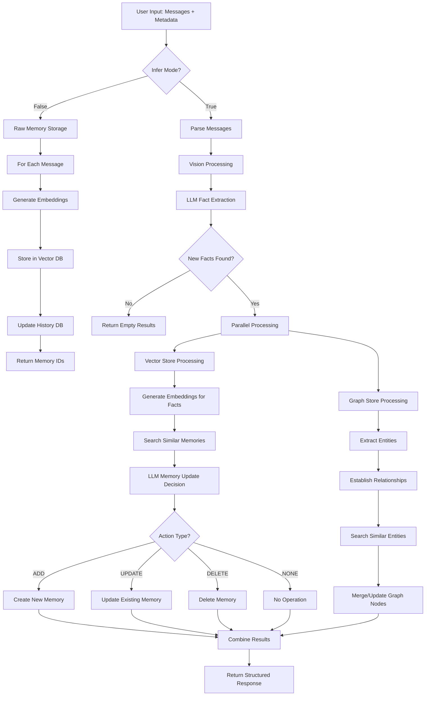
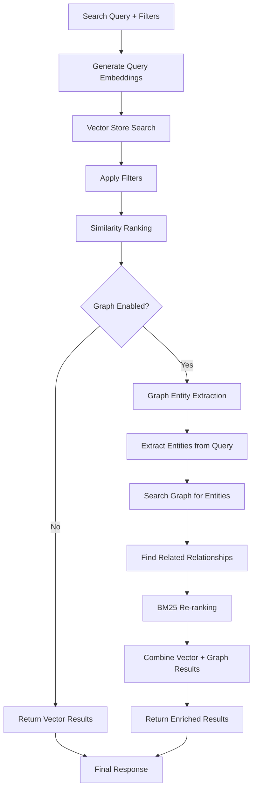
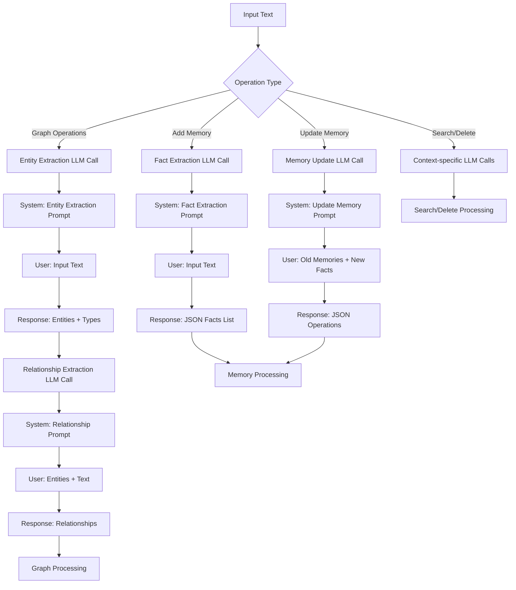
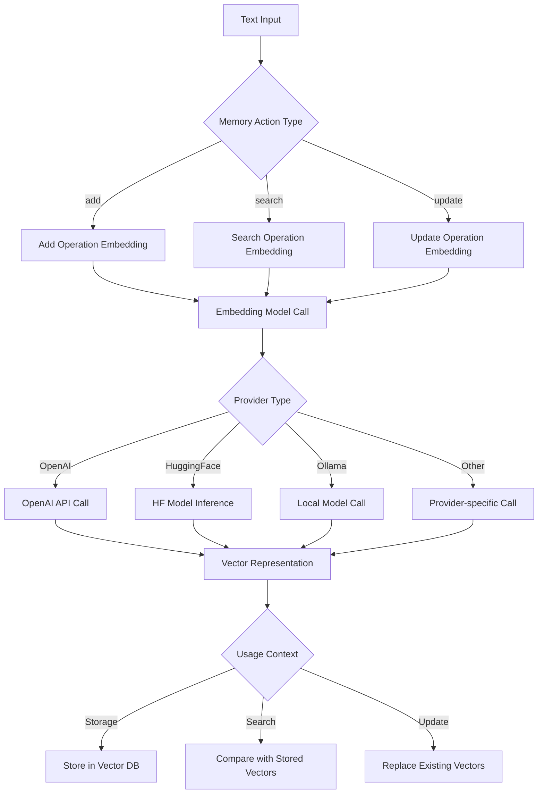
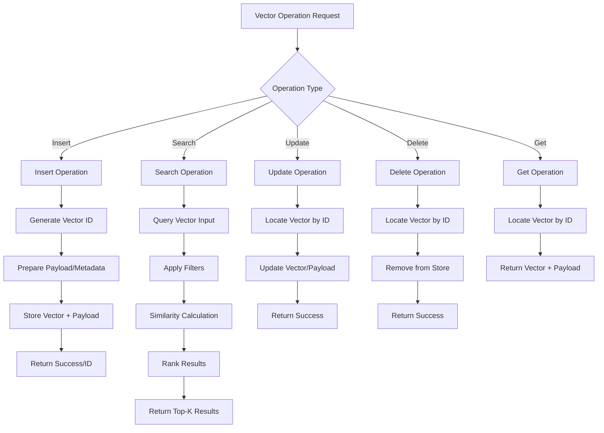
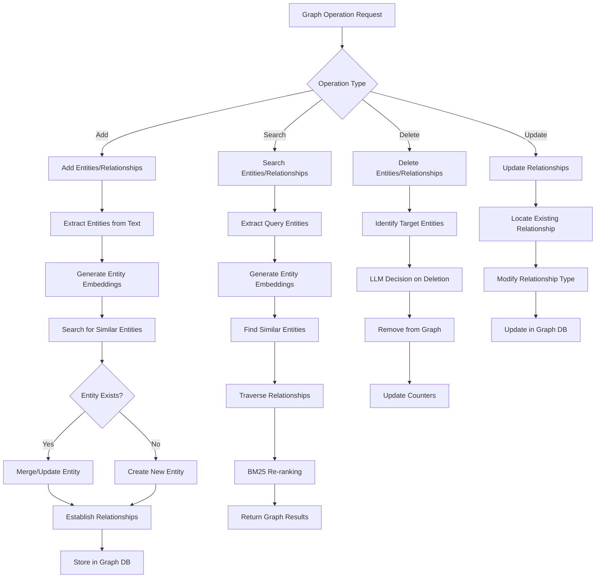
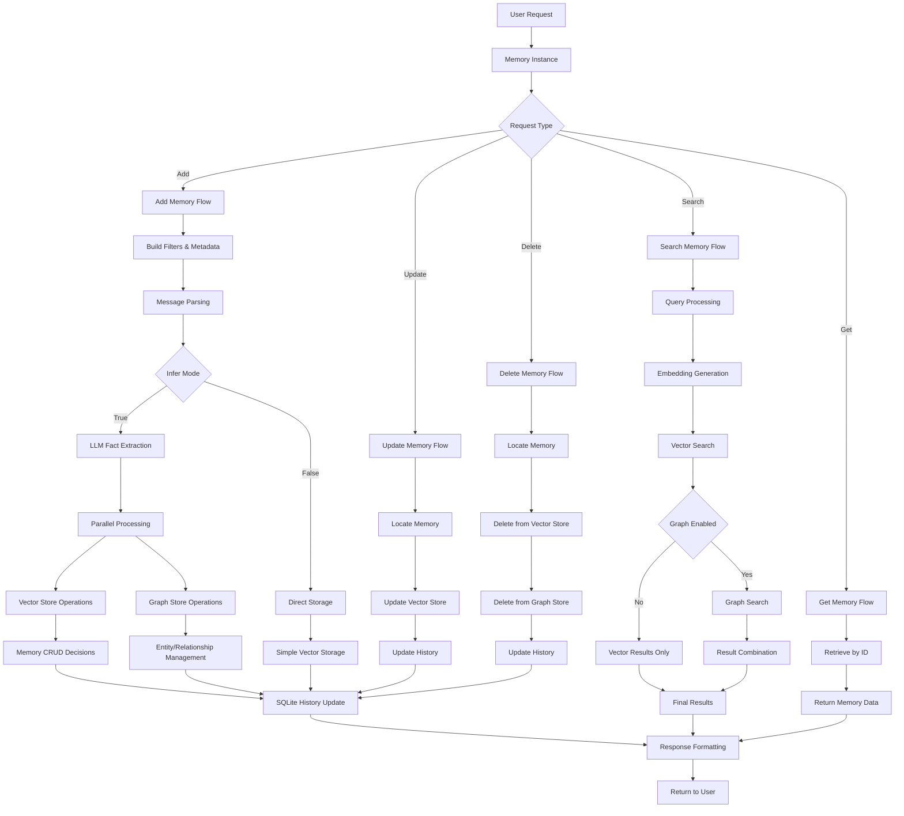
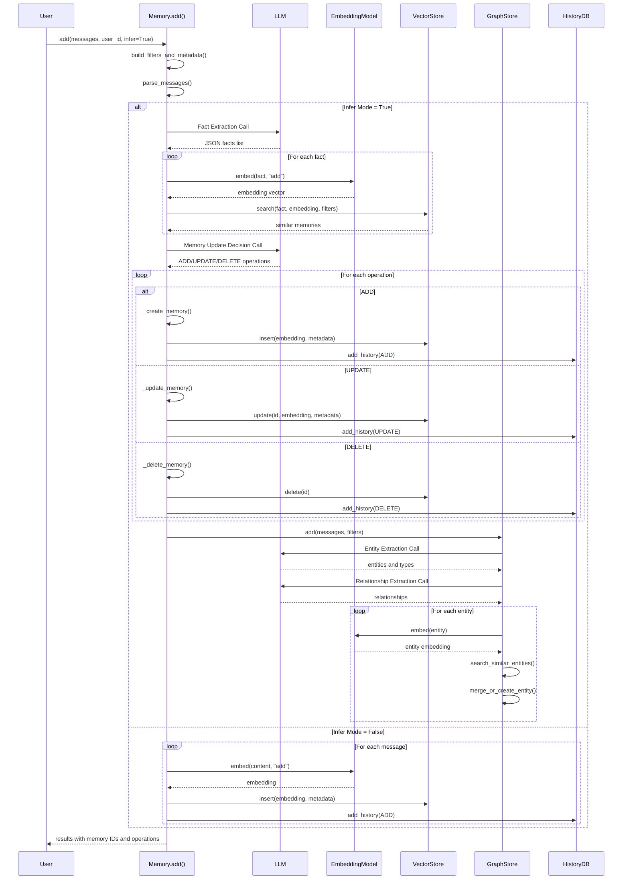

# Mem0 Technical Architecture and Workflow Analysis

## Executive Summary

Mem0 is an intelligent memory layer for AI applications that provides persistent, contextual memory management through a sophisticated architecture combining vector databases, graph databases, Large Language Models (LLMs), and embedding models. This document provides a comprehensive technical analysis of how mem0 operates, including detailed workflows, component interactions, and CRUD operations.

## Core Architecture Overview

Mem0 follows a multi-layered architecture with these key components:

1. **Memory Core**: Central orchestrator managing all memory operations
2. **Vector Storage**: Stores embeddings for semantic similarity search
3. **Graph Storage**: Maintains entity relationships and connections
4. **LLM Integration**: Processes natural language for fact extraction and memory updates
5. **Embedding Model**: Converts text to vector representations
6. **SQLite History**: Tracks memory change history
7. **Factory Pattern**: Creates and manages component instances

## Detailed Component Analysis

### 1. Memory Core (`mem0/memory/main.py`)

The Memory class is the central orchestrator that coordinates all operations:

```python
class Memory(MemoryBase):
    def __init__(self, config: MemoryConfig = MemoryConfig()):
        # Initialize all components
        self.embedding_model = EmbedderFactory.create(...)
        self.vector_store = VectorStoreFactory.create(...)
        self.llm = LlmFactory.create(...)
        self.db = SQLiteManager(...)
        self.graph = MemoryGraph(...) if graph enabled
```

### 2. Vector Storage Layer

Vector stores handle embedding-based similarity search with support for multiple providers:
- Qdrant, Chroma, Pinecone, PGVector, etc.
- Each implements the `VectorStoreBase` interface
- Supports filtering, CRUD operations, and similarity search

### 3. Graph Storage Layer

Graph databases maintain entity relationships:
- Neo4j and Memgraph support
- Stores entities, relationships, and metadata
- Enables complex relationship queries and traversal

### 4. LLM Integration

Multiple LLM providers supported:
- OpenAI, Anthropic, Groq, Together, etc.
- Used for fact extraction and memory update decisions
- Supports structured output for consistent processing

### 5. Embedding Models

Convert text to vector representations:
- OpenAI, HuggingFace, Ollama, etc.
- Used for both storage and retrieval operations
- Configurable dimensions and models

## Complete Workflow Diagrams

### 1. Memory Addition Workflow



### 2. Memory Search Workflow



### 3. LLM Integration Points



### 4. Embedding Generation Workflow



### 5. Vector Database Operations



### 6. Graph Database Operations



### 7. Complete System Integration Flow



## Exact Code Flow Points

### Embedding Generation Call Points

1. **Memory Addition (Raw Mode)**:
   ```python
   # File: mem0/memory/main.py, line ~345
   msg_embeddings = self.embedding_model.embed(msg_content, "add")
   ```

2. **Memory Addition (Infer Mode)**:
   ```python
   # File: mem0/memory/main.py, line ~380
   messages_embeddings = self.embedding_model.embed(new_mem, "add")
   ```

3. **Memory Search**:
   ```python
   # File: mem0/memory/main.py, line ~695
   query_embedding = self.embedding_model.embed(query, "search")
   ```

4. **Graph Entity Processing**:
   ```python
   # File: mem0/memory/graph_memory.py, line ~250
   n_embedding = self.embedding_model.embed(node)
   # And line ~420
   source_embedding = self.embedding_model.embed(source)
   dest_embedding = self.embedding_model.embed(destination)
   ```

### LLM Call Points

1. **Fact Extraction**:
   ```python
   # File: mem0/memory/main.py, line ~365
   response = self.llm.generate_response(
       messages=[
           {"role": "system", "content": system_prompt},
           {"role": "user", "content": user_prompt},
       ],
       response_format={"type": "json_object"},
   )
   ```

2. **Memory Update Decisions**:
   ```python
   # File: mem0/memory/main.py, line ~405
   response: str = self.llm.generate_response(
       messages=[{"role": "user", "content": function_calling_prompt}],
       response_format={"type": "json_object"},
   )
   ```

3. **Graph Entity Extraction**:
   ```python
   # File: mem0/memory/graph_memory.py, line ~140
   search_results = self.llm.generate_response(
       messages=[
           {"role": "system", "content": "...entity extraction..."},
           {"role": "user", "content": data},
       ],
       tools=_tools,
   )
   ```

4. **Graph Relationship Extraction**:
   ```python
   # File: mem0/memory/graph_memory.py, line ~195
   extracted_entities = self.llm.generate_response(
       messages=messages,
       tools=_tools,
   )
   ```

5. **Graph Memory Deletion Decisions**:
   ```python
   # File: mem0/memory/graph_memory.py, line ~315
   memory_updates = self.llm.generate_response(
       messages=[
           {"role": "system", "content": system_prompt},
           {"role": "user", "content": user_prompt},
       ],
       tools=_tools,
   )
   ```

### Detailed Method Flow for Add Operation



## CRUD Operations Deep Dive

### Create (Add) Operations

1. **Input Processing**:
   - Parse messages into structured format
   - Extract metadata and filters
   - Handle multimodal content (images, text)

2. **Fact Extraction** (if infer=True):
   - LLM processes input text
   - Extracts factual information
   - Returns structured JSON facts

3. **Memory Processing**:
   - Generate embeddings for facts
   - Search for similar existing memories
   - LLM decides on ADD/UPDATE/DELETE/NONE operations

4. **Storage Operations**:
   - Vector store: Insert/update embeddings
   - Graph store: Create/update entities and relationships
   - History DB: Record changes

### Read (Search/Get) Operations

1. **Search Operations**:
   - Generate query embeddings
   - Perform vector similarity search
   - Apply filters and ranking
   - Optionally search graph relationships

2. **Get Operations**:
   - Direct retrieval by memory ID
   - Return memory with metadata
   - Include change history if requested

### Update Operations

1. **Locate Memory**: Find existing memory by ID
2. **Generate New Embeddings**: For updated content
3. **Update Vector Store**: Replace old embeddings
4. **Update Metadata**: Modify associated data
5. **Record History**: Track changes in SQLite

### Delete Operations

1. **Single Delete**:
   - Remove from vector store
   - Remove from graph store
   - Mark as deleted in history

2. **Bulk Delete**:
   - Filter by user_id/agent_id/run_id
   - Batch delete operations
   - Clean up orphaned data

## Memory Types and Scoping

### Memory Types

1. **Conversational Memory**: Default fact-based memory from conversations
2. **Procedural Memory**: Task execution and process memory for agents
3. **Raw Memory**: Direct storage without LLM processing

### Scoping Mechanisms

- **User ID**: User-specific memories
- **Agent ID**: Agent-specific memories  
- **Run ID**: Session/run-specific memories
- **Actor ID**: Message sender identification

## Real-time Performance Optimizations

1. **Parallel Processing**: Vector and graph operations run concurrently
2. **Embedding Caching**: Reuse embeddings where possible
3. **Batch Operations**: Group similar operations for efficiency
4. **Connection Pooling**: Efficient database connections
5. **Lazy Loading**: Load components only when needed

## Configuration and Extensibility

### Factory Pattern Implementation

```python
# Dynamic component creation
llm = LlmFactory.create(provider, config)
embedder = EmbedderFactory.create(provider, config)
vector_store = VectorStoreFactory.create(provider, config)
```

### Supported Providers

- **LLMs**: OpenAI, Anthropic, Groq, Together, AWS Bedrock, etc.
- **Embeddings**: OpenAI, HuggingFace, Ollama, etc.
- **Vector Stores**: Qdrant, Chroma, Pinecone, PGVector, etc.
- **Graph Stores**: Neo4j, Memgraph

## Vector Store Implementation Details

### Vector Store Operations (Qdrant Example)

```python
class Qdrant(VectorStoreBase):
    def search(self, query: str, vectors: list, limit: int = 5, filters: dict = None):
        query_filter = self._create_filter(filters) if filters else None
        hits = self.client.query_points(
            collection_name=self.collection_name,
            query=vectors,
            query_filter=query_filter,
            limit=limit,
        )
        return hits.points
```

### Graph Store Implementation Details

```python
class MemoryGraph:
    def add(self, data, filters):
        entity_type_map = self._retrieve_nodes_from_data(data, filters)
        to_be_added = self._establish_nodes_relations_from_data(data, filters, entity_type_map)
        search_output = self._search_graph_db(node_list=list(entity_type_map.keys()), filters=filters)
        to_be_deleted = self._get_delete_entities_from_search_output(search_output, data, filters)
        
        deleted_entities = self._delete_entities(to_be_deleted, filters)
        added_entities = self._add_entities(to_be_added, filters, entity_type_map)
        
        return {"deleted_entities": deleted_entities, "added_entities": added_entities}
```

## Error Handling and Resilience

1. **Graceful Degradation**: Continue operation if optional components fail
2. **Retry Logic**: Automatic retries for transient failures
3. **Validation**: Input validation and sanitization
4. **Logging**: Comprehensive logging for debugging
5. **Transaction Management**: Consistent state across operations

## Security and Privacy

1. **Data Isolation**: Strict separation by user/agent/run IDs
2. **API Key Management**: Secure credential handling
3. **Input Sanitization**: Protection against injection attacks
4. **Audit Trail**: Complete history of all operations

## Performance Characteristics

- **Fact Extraction**: ~91% faster than full-context approaches
- **Token Efficiency**: ~90% reduction in token usage
- **Accuracy**: +26% improvement over OpenAI Memory
- **Scalability**: Horizontal scaling through component separation

## Deployment Options

1. **Self-hosted**: Complete control over data and infrastructure
2. **Managed Service**: Mem0 platform with automatic scaling
3. **Hybrid**: Mix of self-hosted and managed components

This comprehensive analysis demonstrates how Mem0 implements a sophisticated memory management system through careful orchestration of multiple specialized components, providing both semantic search capabilities through vector databases and relationship understanding through graph databases, all coordinated by intelligent LLM-driven decision making.